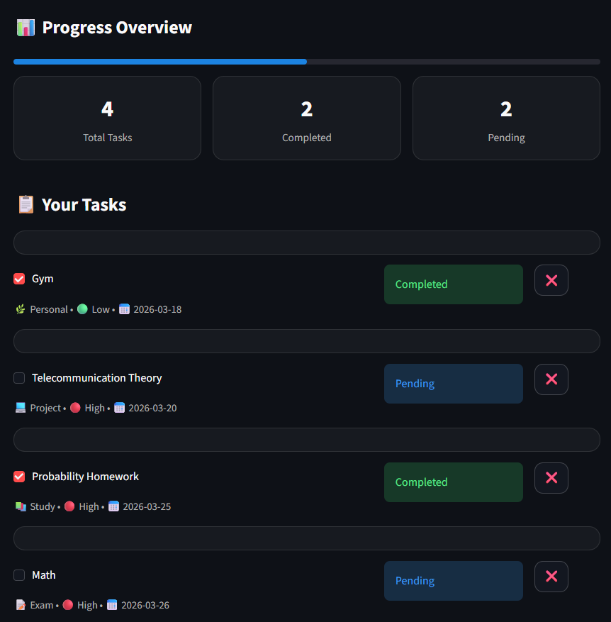

# 🎓 UniLife App

A modern student productivity and task management app built with **Streamlit** and **SQLite**.

---

## 🌐 Live Demo

[👉 Open UniLife App](https://unilife-app-hsct3guzdgwycxuv8wziph.streamlit.app/)

---

## 📸 App Preview



---

## 🚀 Features

- ➕ Add tasks with deadlines
- 📂 Categorize tasks (Study, Exam, Project, Personal)
- ⚡ Set priority levels (High, Medium, Low)
- ✅ Mark tasks as completed
- ❌ Delete tasks
- 🔍 Search tasks
- 🎯 Filter by category and priority
- 📅 Sort tasks by deadline
- 📊 Progress tracking dashboard
- 🔴 Overdue task detection

---

## 🛠 Technologies Used

- Python 🐍
- Streamlit 🎨
- SQLite 🗄️

---

## 📂 Project Structure

```text
unilife-app/
│── app.py
│── database.py
│── requirements.txt
│── README.md
│── screenshot.png
│── tasks.db

⚙️ Installation (Local)
git clone https://github.com/begumonegi/unilife-app.git
cd unilife-app
pip install -r requirements.txt
streamlit run app.py

👩‍💻 Author
Begum Onegi